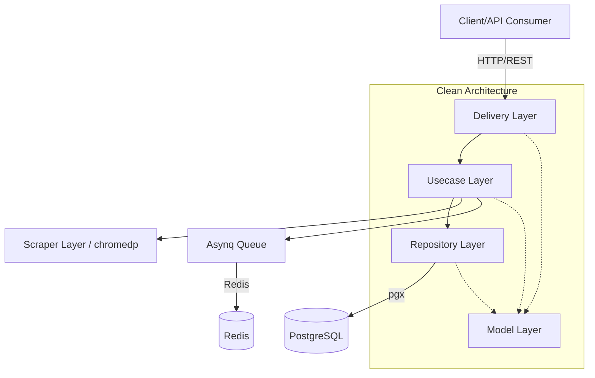

# Grocery Engine Backend

This is the backend service for the Grocery Decision Engine, built with Golang and Clean Architecture.

## System Architecture



## Tech Stack
- **Language:** Go (1.21+)
- **Database:** PostgreSQL (pgx/v5)
- **Message Broker:** Redis (asynq)
- **Scraper:** chromedp

## Running the Application
1. Copy `.env.example` to `.env` (if exists) and update the configurations.
2. Run `go mod tidy` to download dependencies.
3. Start the application:
   ```bash
   go run cmd/api/main.go
   ```

## Testing
Run unit tests across all packages:
```bash
go test ./... -v
```
